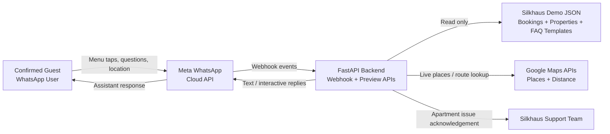
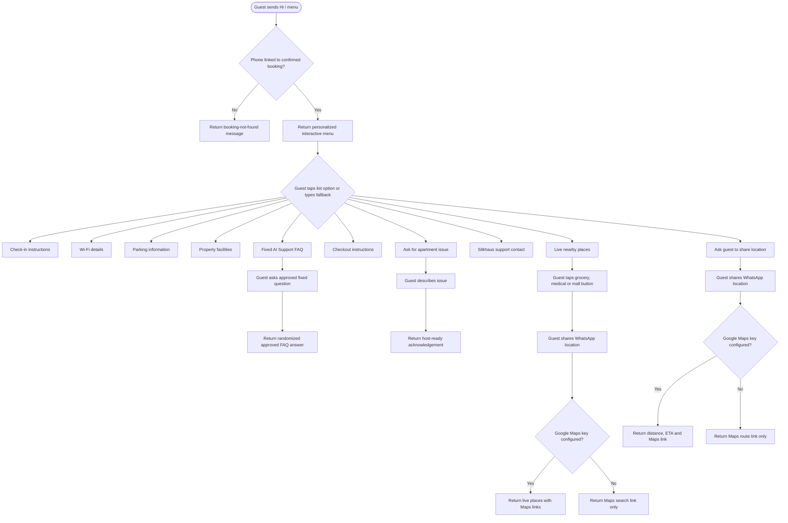
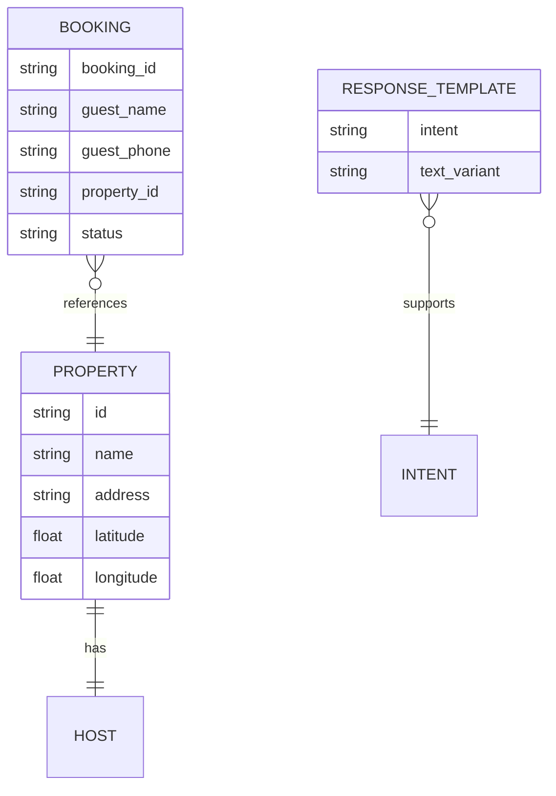

# Silkhaus WhatsApp Concierge POC

## Architecture Overview

The POC is a backend-only Silkhaus WhatsApp concierge. A confirmed guest messages the WhatsApp business number, the backend matches their phone number against demo JSON booking data, and returns rule-based answers from approved response templates.

## Component Responsibilities

| Component | Responsibility |
| --- | --- |
| Guest | Uses WhatsApp to request Silkhaus stay information. |
| Meta WhatsApp Cloud API | Delivers inbound guest messages and outbound assistant replies. |
| FastAPI Backend | Handles webhook verification, message parsing, guest lookup, interactive menu routing, fixed FAQ matching, template selection and Maps calls. |
| Demo JSON | Stores Silkhaus demo bookings, apartment instructions and randomized reply templates. |
| Google Maps APIs | Return live nearby places, distance and travel time when a guest shares location. |
| Silkhaus Support Team | Receives the apartment issue in the production version; this POC only showcases the acknowledgement. |

## Guest Flow

## API Surface

| Area | Endpoint | Purpose |
| --- | --- | --- |
| Health | `GET /health` | Confirms assistant status and demo configuration. |
| WhatsApp verify | `GET /webhook/whatsapp` | Used by Meta to verify the callback URL. |
| WhatsApp receive | `POST /webhook/whatsapp` | Receives WhatsApp messages, list replies, button replies, locations and status updates. |
| Menu preview | `GET /api/whatsapp/menu-preview` | Shows the menu for a demo phone number. |
| Message preview | `POST /api/whatsapp/message-preview` | Previews a guest text message flow. |
| Select preview | `POST /api/whatsapp/select-preview` | Previews a menu/button action. |
| Guest profile | `GET /api/guest/profile` | Exposes matched demo guest/property context. |
| Nearby places | `POST /api/nearby/preview` | Simulates live nearby grocery, medical or mall search. |
| Directions | `POST /api/directions/preview` | Simulates location-based route calculation. |
| Entry point | `GET /api/entry-point` | Generates a WhatsApp deep link for QR/demo use. |

## Data Model

The POC data is read from `backend/data/guest_assistant_demo.json`.

## Current Scope

Completed:

- Rule-based WhatsApp guest assistant.
- Randomized approved response variants.
- Confirmed guest lookup from JSON.
- Silkhaus-branded demo bookings, apartments and support language.
- Fixed-question "Silkhaus AI Support" flow without AI/LLM calls.
- WhatsApp interactive list menu and nearby category buttons.
- Check-in, Wi-Fi, parking, facilities, live nearby places, checkout and host contact.
- Maintenance issue acknowledgement without storage.
- Location-based Google Places nearby search with search-link fallback.
- Location-based directions with Google Maps API support and link-only fallback.
- Backend-only Vercel deployment config.

Deferred:

- Real PMS/channel-manager booking sync.
- Persistent maintenance issue ticketing.
- Host dashboard.
- Multilingual templates.
- Media/document handling.
